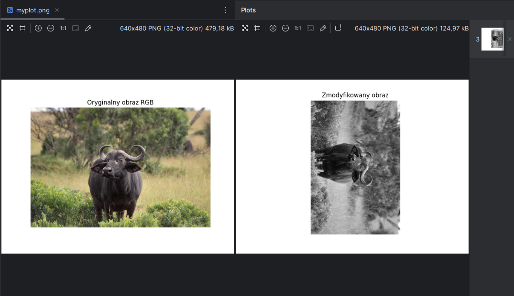

# Przetwarzanie obrazów z użyciem Python



1. Pobranie obrazu z Internetu przy użyciu `urllib.request`.
2. Wyświetlenie oryginalnego obrazu w oknie Matplotlib.
3. Modyfikacja obrazu:
   - konwersja do skali szarości (grayscale),
   - zmniejszenie rozmiaru do 50% oryginału,
   - obrót o 90° w prawo.
4. Wyświetlenie zmodyfikowanego obrazu.
5. Wyświetlenie informacji o obrazach w konsoli: Macierz obrazu i rozmiar (W, H).

Wynik konsoli:
```
Macierz domyślnego obrazu:
 [[[230 227 220]
  [235 232 225]
  [242 239 234]
  ...
  [251 251 251]
  [251 251 251]
  [251 251 251]]

 [[229 226 219]
  [235 232 225]
  [242 239 234]
  ...
  [251 251 251]
  [251 251 251]
  [251 251 251]]

 [[226 223 214]
  [233 230 221]
  [240 237 230]
  ...
  [251 251 251]
  [251 251 251]
  [251 251 251]]

 ...

 [[166 169 122]
  [152 155 108]
  [143 146  99]
  ...
  [120 110  75]
  [128 122  90]
  [144 139 107]]

 [[156 159 112]
  [151 154 107]
  [141 144  97]
  ...
  [120 110  75]
  [129 123  89]
  [148 143 111]]

 [[144 150 102]
  [144 150 102]
  [136 142  94]
  ...
  [145 132  98]
  [144 135 102]
  [158 152 118]]] 
Rozmiar: (853, 1280, 3) 

Macierz zmodyfikowanego obrazu:
 [[146 153 147 ... 221 225 230]
 [145 146 145 ... 236 239 240]
 [154 141 124 ... 246 246 244]
 ...
 [139 126 126 ... 252 252 251]
 [125 114 142 ... 251 251 251]
 [134 129 130 ... 250 251 251]] 
Rozmiar: (640, 426)
```
