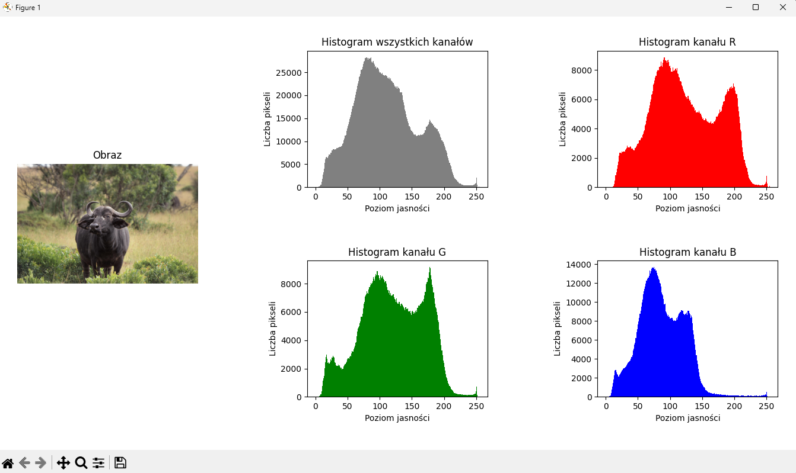

# Analiza jakości zdjęć na podstawie automatycznej oceny histogramu

1. Pobranie obrazu z Internetu (`urllib.request`).
2. Odczytanie głębi bitowej obrazu (zastosowanie `Image.histogram()` ograniczałoby do obrazów 8-bitowych). 
3. Wydobycie histogramu całego obrazu oraz poszczególnych kanałów RGB (rozdzielenie kanałów `Image.split()`).
4. Utworzenie układu (`matplotlib.pyplot.subplot_mosaic`):
  * po lewej - oryginalny obraz,
  * po prawej - cztery histogramy 2x2:
    * histogram wszystkich kanałów,
    * histogram kanału R,
    * histogram kanału G,
    * histogram kanału B.
5. Wyświetlenie obrazu i histogramów w oknie Matplotlib.
6. Analiza jakości obrazu.

## Algorytm
* oblicza histogram obrazu,
* normalizuje go do postaci procentowej,
* oblicza średnią jasność obrazu,
* analizuje skrajne zakresy jasności (bardzo ciemne i bardzo jasne piksele).

Na tej podstawie:
* wykrywa niedoświetlenie (zbyt dużo ciemnych pikseli),
* wykrywa prześwietlenie (zbyt dużo jasnych pikseli),
* lub uznaje obraz za prawidłowo naświetlony.

Odpowiedź zwraca typu `str`:
* `Niedoświetlone`
* `Prześwietlone`
* `Prawidłowe`
